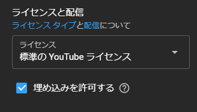
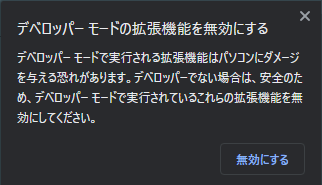

## 概要
YoutubeのミニプレイヤーChrome拡張機能です。  
sample.pngを見てもらえれば分かると思います。  

動画IDをコピーしてURLに置き換えて別ウィンドウとして表示させるだけのものなので、  
下記にあるソース改造次第でチャットや他動画サイトでも動作可能です。  

| ファイル名 | 説明 |
| ---- | ---- |
| README.md | 本ファイル |
| event.js | プログラム本体 |
| icon.png | アイコン画像 |
| manifest.json | 設定ファイル |
| sample.png | 実際の動作画面 |

## インストール
> event.js  
> manifest.json  
> icon.png  

上記3ファイルをダウンロードして一つのフォルダにまとめます。  
[Chrome拡張機能を管理] の画面右上にある [デベロッパーモード] をONにします。  
[パッケージ化されていない拡張機能を読み込む] から作成したフォルダを指定。  
エラーがでますが気にせず。  
[デベロッパーモード] をOFFにします。  
[ファイルのURLへのアクセスを許可する] をONにします。  
以上です。  

補足として「chrome 野良拡張 インストール」等で検索すると良いかと。

## 使い方
Youtube画面の"動画じゃない部分"で右クリック。  
でてきたメニューから当拡張機能を選択します。  
初期状態では「Popout for Youtube」となっています。  

複数Popoutさせたい場合、広告が流れてるだろう間に2つ目の動画をPopoutさせると、  
1つ目のPopoutに上書きされるので30秒程度待ってから再度お試しください。  

## 注意事項
Youtubeの場合、配信者側の設定で埋め込みの許可をしてないと視聴できません。  
  

[デベロッパーモードの拡張機能を無効にする] がでることがあります。  
上記ワードで検索すれば対応策がでてくるので、適宜対応してください。

## ソース改造

