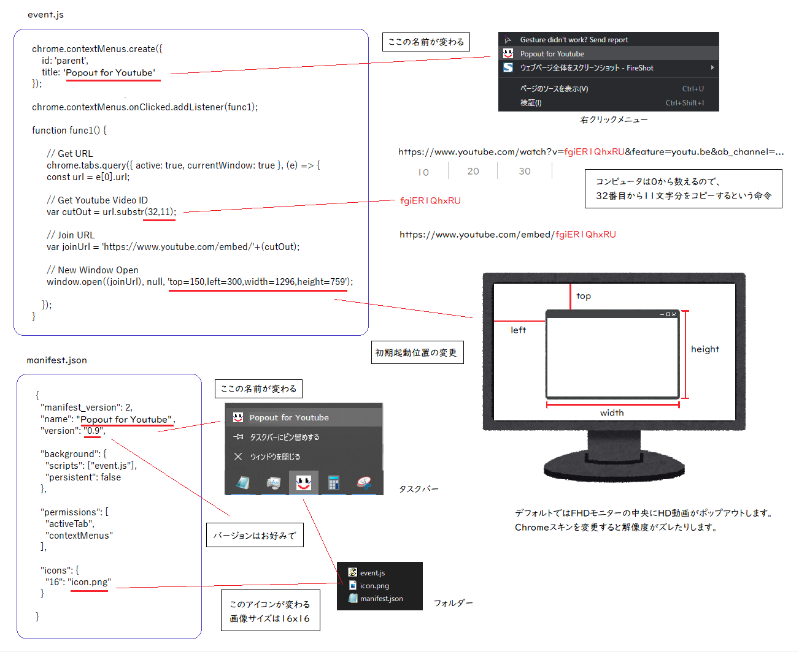

## 概要
YoutubeのミニプレイヤーChrome拡張機能です。  
sample.pngを見てもらえれば分かると思います。  

動画IDをコピーしてURLに置き換えて別ウィンドウとして表示させるだけのものなので、  
下記にあるソース改造次第でチャットや他動画サイトでも動作可能です。  

| ファイル名 | 説明 |
| ---- | ---- |
| README.md | 本ファイル |
| event.js | プログラム本体 |
| icon.png | アイコン画像 |
| manifest.json | 設定ファイル |
| sample.png | 実際の動作画面 |

## インストール
「chrome 野良拡張 インストール」等で検索すると良いかと。  

> event.js  
> manifest.json  
> icon.png  

上記3ファイルをダウンロードして一つのフォルダにまとめます。  
[Chrome拡張機能を管理] の画面右上にある [デベロッパーモード] をONにします。  
[パッケージ化されていない拡張機能を読み込む] から作成したフォルダを指定。  
エラーが出ますが気にせず。  
[デベロッパーモード] をOFFにします。  
拡張機能の詳細から [ファイルのURLへのアクセスを許可する] をONにします。  
以上です。  


## 使い方
Youtube画面の"動画じゃない部分"で右クリック。  
でてきたメニューから当拡張機能を選択します。  


複数Popoutさせたい場合、広告が流れてるだろう間に2つ目の動画をPopoutさせると、  
1つ目のPopoutに上書きされるので30秒程度待ってから再度お試しください。  
Adblock系を貫通します。  
ブラウザに残ってる方の動画には広告が表示されます。  
Popoutした方の動画には広告は表示されませんが実際には流れているものと思ってください。  


## 注意事項
Youtubeの場合、配信者側の設定で埋め込みの許可をしてないと視聴できません。  
Youtube埋め込みプレイヤーをウィンドウ外に放り出してるからです。  
  

[デベロッパーモードの拡張機能を無効にする] がでることがあります。  
上記ワードで検索すれば対応策がでてくるので、適宜対応してください。  
レジストリキーをいぢる系なので、ちょっと面倒です。  


## ソース改造
  
目標解像度からスキン(枠)の分だけ足してやる。  
Windows10, デフォルトスキンの場合、width+16, height+39となる。  
| 目標 | 指定 |
| ---- | ---- |
| 1920x1080 | 1936x1119 |
| 1280x720 | 1296x759 |
| 854x480 | 870x519 |
| 640x360 | 656x399 |
| 426x240 | 442x279 |

**YoutubeのライブID　※動画も兼用**  
```      var cutOut = url.substr(32,11);```  
      var joinUrl = 'https://www.youtube.com/embed/'+(cutOut)  

**Youtubeのチャット**  
      var joinUrl = 'https://www.youtube.com/live_chat?v='+(cutOut)  

**チャットのサイズ**  
      window.open((joinChatUrl), null, 'top=300,left=500,width=500,height=900'  

**Youtube 自動再生ON**  
      var joinUrl = 'https://www.youtube.com/embed/'+(cutOut)+'?autoplay=1';  

**Youtube プレイリスト**  
      var cutOut = url.substr(49,34);  
      var joinUrl = 'https://www.youtube.com/embed/?list='+(cutOut);  

**Youtube サムネイル画像**  
      var joinChatUrl = 'http://img.youtube.com/vi/'+(cutOut)+'/maxresdefault.jpg';  
      window.open((joinChatUrl), null, 'top=300,left=500,width=1296,height=759');  

TwitchのライブID  
      var cutOut = url.substr(22,64);  
      var joinChatUrl = 'https://player.twitch.tv/?channel='+(cutOut)+'&enableExtensions=true&parent=twitch.tv'  

**Twitchのチャット**  
      var joinChatUrl = 'https://www.twitch.tv/popout/'+(cutOut)+'/chat?popout='  

**Twitchの動画**  
      var cutOut = url.substr(29,10);  
      var joinChatUrl = 'https://player.twitch.tv/?video='+(cutOut)+'&enableExtensions=true&parent=twitch.tv'  

**xvideos**  
      var cutOut = url.substr(29,37);  
      var joinUrl = 'https://www.xvideos.com/embedframe/'+(cutOut);  

**パラメーターについて**  
https://developers.google.com/youtube/player_parameters?hl=ja
